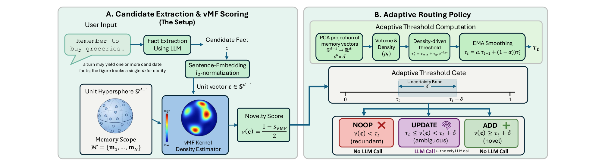
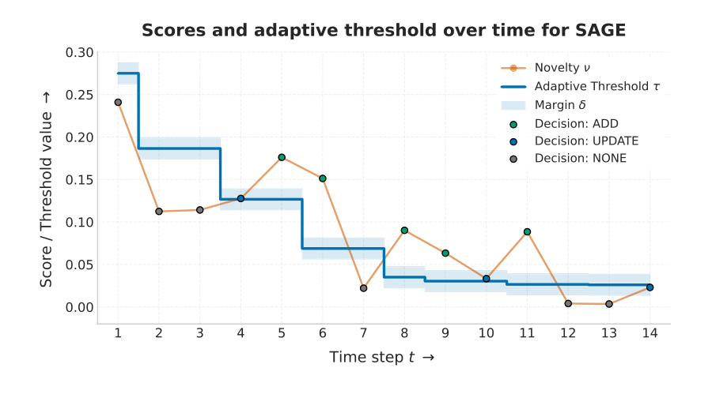

# <a href="#why-an-owl"></a> SAGE: A Novelty Gate for Efficient Memory Evolution in Agentic LLMs

[](https://arxiv.org/abs/2605.30711)

SAGE is a long-term memory layer for LLM agents that decides what to write
**without an LLM call**. It is built as a fork of [mem0](https://github.com/mem0ai/mem0):
mem0 issues a per-write LLM call to route each candidate fact to ADD / UPDATE / DELETE / NOOP,
whereas SAGE replaces that routing with a **vector-math novelty gate** — a von
Mises–Fisher KDE novelty score compared against an adaptive per-scope threshold. The
fact-extraction step is unchanged, so SAGE is a drop-in alternative to mem0's write
path that issues far fewer write-side LLM calls and generates far fewer tokens.

<p align="center">
  
</p>
<p align="center"><em>Overview of Memory Evolution problem and our proposed approach SAGE.</em></p>

<p align="center">
  
</p>
<p align="center"><em>As the memory scope expands and the projection subspace becomes more densely populated, the baseline novelty scores of incoming candidates naturally trend downward because new facts are more likely to fall near established memories. To prevent the system from becoming overly conservative, the adaptive threshold &tau;<sub>t</sub> (the solid blue line) decays over time in response to the increasing density proxy &rho;<sub>t</sub>.</em></p>

> **🔬 [Try the interactive novelty-gate demo &rarr;](https://swang1024.github.io/SAGE/demo/sage_novelty_gate_demo.html)** &mdash; add candidate facts and watch the vMF-KDE novelty score and adaptive threshold route each one to NOOP / UPDATE / ADD, all in the browser.

## Results (LoCoMo, gpt-4o-mini)

Measured on full LoCoMo with a gpt-4o-mini backbone and a gpt-4o-mini LLM-as-judge
(`batch_size=8`), SAGE vs the mem0 baseline:

| | mem0 | SAGE |
|---|---|---|
| Write-side LLM calls | 3,217 | 2,297 |
| Write-side total tokens | 5.55M | 2.16M (**≈61% fewer**) |
| Generated (completion) tokens | 0.91M | 0.08M (**≈11× fewer**) |
| Ingestion wall-clock | 39.3 min | 15.7 min (**≈2.5× faster**) |
| LLM-judge accuracy (macro) | 53.5 | 52.2 (within **≈1.3 points**) |

Write-side counts/tokens are the chat-LLM totals (embedding-API calls excluded). All
of these numbers regenerate from committed result summaries — see
[`evaluation/README.md`](evaluation/README.md) and
[`evaluation/paper_results/`](evaluation/paper_results/).

## Repository layout

This repo is the mem0 library with the SAGE contribution plus an evaluation harness;
the unrelated mem0 sub-projects (docs site, JS/TS SDKs, server, examples, etc.) have
been removed.

```
mem0/                       # the memory library (mem0 core + SAGE)
  memory/novelty_gate.py    #   SAGE: vMF-KDE novelty scorer + adaptive threshold
  memory/main.py            #   enable_sage write path that uses the gate
  llms/usage_tracker.py     #   write-side LLM call / token / latency instrumentation
evaluation/                 # LOCOMO benchmark suite, run scripts, table generators
  README.md                 #   how to run the benchmark and reproduce the paper tables
  paper_results/            #   committed result summaries the tables are built from
tests/                      # tests for the library and the SAGE gate
```

## Installation

Requires **Python 3.9+**. The dependencies are declared in
[`pyproject.toml`](pyproject.toml); we recommend [uv](https://docs.astral.sh/uv/) to
create an isolated environment and install the package editable in one step:

```bash
uv venv --python 3.12 .venv          # create a virtualenv
source .venv/bin/activate
uv pip install -e ".[eval]"          # SAGE/mem0 + the evaluation extras
```

The `[eval]` extra adds the LOCOMO evaluation framework and scoring metrics (the latter
pull in PyTorch via `sentence-transformers`/`bert-score`). Installing editable
registers the local source as the `sage` distribution, so `from mem0 import Memory`
works from any directory — SAGE is still imported as `mem0` (it is a modified mem0
fork, **not** the upstream `mem0ai` package; do **not** `pip install mem0ai`, it would
shadow this fork). Optional baselines (RAG, LangMem, Zep) and their extra packages are
listed, commented out, at the bottom of [`requirements.txt`](requirements.txt).

<details>
<summary>Plain pip (no uv)</summary>

```bash
pip install -r requirements.txt   # deps only; runner adds the repo root to sys.path
pip install -e .                  # optional: register `sage` so `import mem0` works anywhere
```

</details>

### Ollama (only for the open-weight runs)

The OpenAI (gpt-4o-mini) results above need **no** extra software beyond the Python
deps. The **open-weight** runs (Qwen / Llama / DeepSeek backbones, and the
open-weight LLM-as-judge) talk to a local [Ollama](https://ollama.com) server. The
`ollama` Python package installed above is **only the client** — you must also
install the Ollama **runtime** and pull the model weights (neither ships with pip or
this repo, and both are multi-GB). This needs a **GPU**.

```bash
# 1. Install the Ollama runtime (separate from pip):
curl -fsSL https://ollama.com/install.sh | sh     # Linux; macOS: brew install ollama

# 2. Pull the three models the open-weight path uses:
ollama pull qwen2.5:3b         # backbone LLM
ollama pull nomic-embed-text   # embedder
ollama pull llama3.1:8b        # LLM-as-judge
```

You don't have to start the server or pull manually if you use the one-command
reproduction script below — it launches an Ollama server (reusing one already
listening on `$OLLAMA_HOST`, default `127.0.0.1:11434`) and pulls all three models
for you. The manual steps are listed so the prerequisites are explicit.

<details>
<summary><strong>No root privileges?</strong> Install Ollama locally in the project folder</summary>

If you can't run the `curl ... | sh` installer (no root) or `ollama` isn't on your
path, set it up locally within the project folder:

1. **Download and extract Ollama** (newer releases ship as `.tar.zst`):

   ```bash
   mkdir -p bin lib
   curl -L https://github.com/ollama/ollama/releases/download/v0.30.7/ollama-linux-amd64.tar.zst -o ollama-linux-amd64.tar.zst
   zstd -d -c ollama-linux-amd64.tar.zst | tar -xv
   ```

2. **Configure the path** so the script can locate the `ollama` executable:

   ```bash
   export PATH="/path/to/SAGE/bin:$PATH"
   ```

3. **Redirect model storage (crucial for clusters).** By default Ollama downloads
   weights (several GB each) to `~/.ollama/models`. On a cluster with tight home
   quotas (e.g. Duke Compute Cluster `/hpc/home`), redirect this to a high-capacity
   group or scratch folder:

   ```bash
   export OLLAMA_MODELS="/path/to/SAGE/.ollama/models"
   ```

</details>

## Using SAGE

SAGE is enabled through the standard mem0 `MemoryConfig`; set `enable_sage` and
configure the vector store / LLM / embedder as you would for mem0:

```python
from mem0 import Memory

memory = Memory.from_config({
    "enable_sage": True,            # route writes through the novelty gate
    "sage_novelty_method": "vmf_kde",  # "vmf_kde" (default) or "gaussian_kde"
    # ... your usual vector_store / llm / embedder config ...
})

memory.add(messages, user_id="alice")          # gated write, no routing LLM call
memory.search(query="...", user_id="alice")    # retrieval is unchanged from mem0
```

With `enable_sage=False`, `Memory` behaves exactly like upstream mem0.

## Reproducing the paper

Quickstart for the headline result (full LoCoMo, gpt-4o-mini backbone + judge, SAGE
vs the mem0 baseline). Put your key in a repo-root `.env` (`OPENAI_API_KEY="sk-..."`).

Run it all in one command (steps 1–3 below):

```bash
bash reproduce_main_result.sh
```

Or run the steps individually from `evaluation/`:

```bash
# 1. Run SAGE and mem0 (add + search) at the paper's batch_size=8
bash run_openai.sh mem0 gpt-4o-mini full 8
bash run_openai.sh sage gpt-4o-mini full 8

# 2. Score with the gpt-4o-mini LLM-as-judge
bash score_openai.sh bs8

# 3. View per-category + overall accuracy
python generate_scores.py results_openai_full_bs8 \
  --runs mem0_gpt-4o-mini/eval_metrics_judge4omini.json \
         sage_gpt-4o-mini/eval_metrics_judge4omini.json

# 4. Regenerate the paper's efficiency + accuracy tables
python make_results_tex.py && python gen_token_table.pys
```

Step 4 rebuilds the tables from the pre-computed result summaries in
[`evaluation/paper_results/`](evaluation/paper_results/).

### Open-weight reproduction (no OpenAI key)

Same experiment with opensource models: full LoCoMo with a **qwen2.5:3b** backbone, scored
by a **llama3.1:8b** judge — the open-weight (Table 3) comparison. Install the Ollama
runtime first (see [Ollama](#ollama-only-for-the-open-weight-runs) above), then run:

```bash
bash reproduce_openweight_result.sh
```

This starts an Ollama server (or reuses one at `$OLLAMA_HOST`), pulls `qwen2.5:3b`,
`nomic-embed-text`, and `llama3.1:8b`, runs the mem0 baseline and SAGE, scores every
answer file with the llama judge, and writes the score table to
`results_full/scores_summary.txt`. It needs a GPU and is a long local run (~hours).
No `.env` / OpenAI key is required.

To rebuild the paper's tables from your own fresh runs, and for the optional mem0g
graph baseline, see the full step-by-step in
[`evaluation/README.md`](evaluation/README.md).

## Relationship to mem0 and license

This repository is a **modified fork of [mem0](https://github.com/mem0ai/mem0)**,
licensed under the **Apache License 2.0**. The original copyright is retained in
[`LICENSE`](LICENSE), and the upstream/derivative attribution is recorded in
[`NOTICE`](NOTICE).

## Citation

If you use SAGE in your research, please cite our paper
([arXiv:2605.30711](https://arxiv.org/abs/2605.30711)):

```bibtex
@article{wang2026sage,
  title   = {SAGE: A Novelty Gate for Efficient Memory Evolution in Agentic LLMs},
  author  = {Wang, Sijia and Brahma, Dhanajit and Henao, Ricardo},
  journal = {arXiv preprint arXiv:2605.30711},
  year    = {2026}
}
```

<details id="why-an-owl">
<summary>🦉 Why an owl?</summary>

<br>

The owl is the age-old emblem of the **sage**: wisdom, and the discernment to keep only what's worth keeping.

SAGE shares that gaze — selective, unhurried, writing to memory only when something is truly new.

<sub>An attempt by researchers to hold agentic systems to a higher standard of rigor.</sub>

</details>
